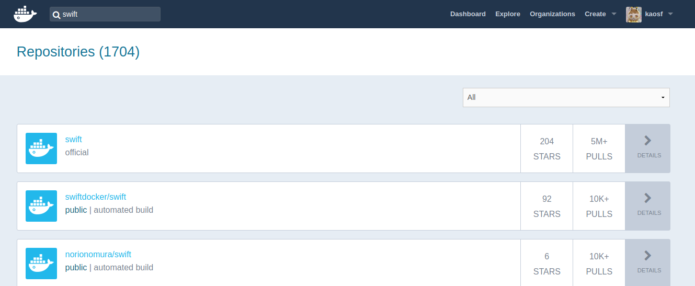

% Swift Tour
% ka
% 2018-09-15

# Author

ka

[](https://en.gravatar.com/ka000)

Website: [kaosfield](https://www.kaosfield.net)

Twitter: [ka](https://twitter.com/ka_)

GitHub: [kaosf](https://github.com/kaosf)

# License

[](https://creativecommons.org/licenses/by-nc-sa/4.0/)

Copyright (C) 2018 ka

# このページとリポジトリ

[https://kaosf.github.io/20180915-swift-tour-slide](https://kaosf.github.io/20180915-swift-tour-slide)

Repository: [20180915-swift-tour-slide - GitHub](https://github.com/kaosf/20180915-swift-tour-slide)

# Swift Tourに参加して

初Swiftです

# 今日の環境

Macbook持ってないので家でMac miniが動いててそれをリモートデスクトップで使う

つまりMac上で普通にスラスラ開発は出来ない

※今日この会場でMacじゃないの自分だけでは？

#

やるぞ！

#

一応LinuxでもSwiftのコンパイルは出来るらしいがつらそう

Swiftの利用目的が現状結局iOSアプリかMacアプリ

#

Swift PlaygroundsがインストールしようとしてもApp Store限定と言われて動かせん

#

グラフィカルなのやるには環境用意してるだけで時間かかりそうな気がする

#

そもそもSwift初心者だしと開き直って目標は低めに定める

RxSwiftを理解するとか出来たら良かったけど欲張らない

#

まずはSwiftに慣れよう

Optional型，パターンマッチ辺りのSwiftでの理解を自分に定着させよう

#

どうせCLIならUbuntuでやるだけでもいいかもしれん

Vimも使えるし

#

やるぞ！

```sh
$ sudo docker run -it ubuntu:16.04 bash
```

#

[https://swift.org/download/#releases](https://swift.org/download/#releases)

を参考にしつつ…

```sh
# apt update
# apt -y upgrade
# apt install wget
# wget https://swift.org/builds/swift-4.1.3-release/ubuntu1604/swift-4.1.3-RELEASE/swift-4.1.3-RELEASE-ubuntu16.04.tar.gz

# tar xf swift-4.1.3-RELEASE-ubuntu16.04.tar.gz
# mv swift-4.1.3-RELEASE-ubuntu16.04/usr /usr/local/swift
# export PATH=/usr/local/swift/bin:$PATH
```

#

あかん

```
# swift --version
swift: error while loading shared libraries: libatomic.so.1: cannot open shared object file: No such file or directory
```

#

```
# apt search libatomic
```

とか探してみてそれらしいものを見つける

#

じゃあこれで

```sh
# apt install libatomic1
```

#

あかん(2nd)

```
# swift --version
swift: error while loading shared libraries: libedit.so.2: cannot open shared object file: No such file or directory
```

#

また探してみて以下で

```
# apt install libedit2
```

#

いけた！

```
# swift --version
Swift version 4.1.3 (swift-4.1.3-RELEASE)
Target: x86_64-unknown-linux-gnu
```

#

と思ったけどhelloworld.swiftを用意してみると…

あかん(3rd)

```
# swiftc -v helloworld.swift
...
<unknown>:0: error: link command failed with exit code 127 (use -v to see invocation)
```

#

clangやな

```
# apt install clang
```

#

いけた！！

```
# swiftc helloworld.swift
```

#

あかん(4th)

```
# ./helloworld
./helloworld: error while loading shared libraries: libicuuc.so.55: cannot open shared object file: No such file or directory
```

#

そしてとうとう本当に必要だったものを特定しました

(最後に必要だったのはlibicu55)

```
# apt -y install clang libatomic1 libedit2 libicu55
```

#

ここまでで参考にしたサイトなど

<ul>
<li>[https://swift.org/download/#releases](https://swift.org/download/#releases)</li>
<li>[https://swift.org/getting-started/#installing-swift](https://swift.org/getting-started/#installing-swift)</li>
<li>[http://obelisk.hatenablog.com/entry/2017/10/05/125812](http://obelisk.hatenablog.com/entry/2017/10/05/125812)</li>
<li>`sudo ldconfig -v` コマンドの出力</li>
</ul>

#

```
# echo 'print("Hello World!")' > helloworld.swift

# swift helloworld.swift
Hello World!
```


# ここで気付く

<div style="text-align: center; margin-top: 25%">
( ˘⊖˘) 。o(まてよ、Swiftのコンテナイメージがそもそもあるんじゃ……？)
</div>

#

<div style="text-align: center; margin-top: 25%">
|DockerHub|┗(☋｀ )┓三
</div>

#

<div style="text-align: center">
( ◠‿◠ )☛


</div>

#

<div style="text-align: center; margin-top: 25%">
▂▅▇█▓▒░(’ω’)░▒▓█▇▅▂ うわあああああぁぁぁぁぁぁぁ
</div>

#

はい

```
$ sudo docker run -it swift bash
```

```
# echo 'print("Hello World!")' > helloworld.swift
# swift helloworld.swift
Hello World!
```

# まとめ

Dockerはべんり

# おまけ

今日Swiftを試せるようになって書いた最大限のコード

<div style="font-size: 70%">
```swift
func f1(x: Int?) {
  if x == nil {
    print("nil")
  } else {
    // print(x) // BAD
    print(x!) // NOT GOOD
  }
}

func f(_ x: Int?) {
  if let x = x {
    print(x)
  } else {
    print("nil")
  }
}

func g(_ x: Int?) {
  switch x {
    case _?: print(x!)
    case nil: print("nil")
  }
}

let foo: Int? = 1
f1(x: foo)
f(foo)
g(foo)

let bar: Int? = nil
f1(x: bar)
f(bar)
g(bar)
```
</div>

#

Optional型とパターンマッチについて勉強出来たことが分かる

あと関数の引数に「外部引数名」という概念があることが分かった

#

<div style="text-align: center; margin-top: 25%; font-size: 200%">
Swift完全に理解した
</div>

#

おわり
